Introduction
============

This User Guide proposes to describe the way the application should be used and all the functionalities that are available
within the application.

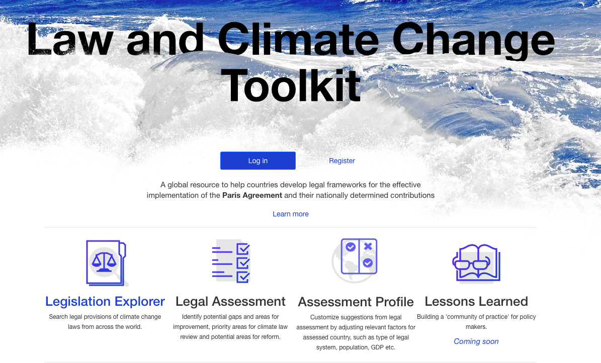

    *Main application page*

The first page, available at https://climatelawtoolkit.org/, is the HomePage presented in *Figure 1*. From this page, the user
is able to login or register in the application, or access the Legislation Explorer, the Legal Assessment or the Assessment 
Profile page. The last 2 are only available to the authenticated users.

Authentication
==============

-----
Login
-----

The user can login by clicking on the "Login" link from the homepage. In case the user forgot their password, they have
the option to reset their password by requesting a password change. They will receive an e-mail with a link for the
password change on the e-mail address provided, given that the e-mail is linked to an user existing in the application.
*Figure 2*

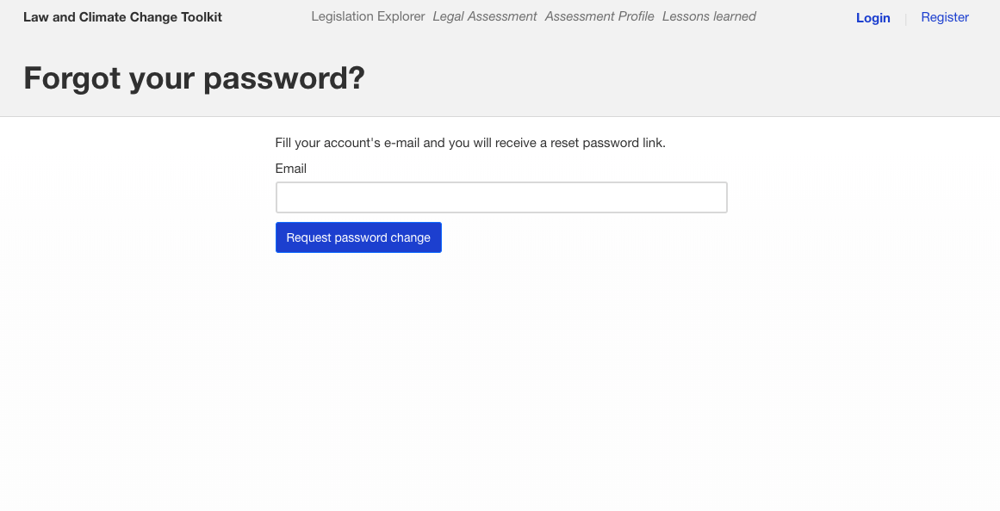

    *Forgot your password page*

------------
Registration
------------

The user can request an application account (*Figure 3*). The account will have to be approved. For the registration process,
the first name, last name, email, affiliation, country and desired role. The user will be informed if the account
was approved or denied. If it was approved, the user will receive an e-mail containing a link for setting their password.

    *Registration page*

----------------------------------
Approval of a registration request
----------------------------------

The **registration requests** can only be handled by users with administrative rights. Those users will receive an e-mail
informing them that a new registration request was made. The e-mail will contain a link with the user approval page.
On the user approval page(*Figure 4*), the administrator can check all the details that the user submited in his application
and approve or deny the request. In the case of an approval, the new user will receive an e-mail with the granted role and a
link for setting their password.

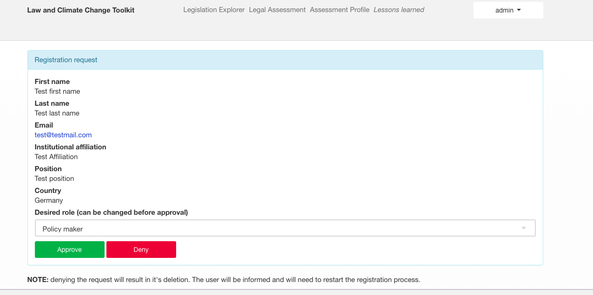

    *Approval of a registration request page*

---------------------------------
Alternative for approving process
---------------------------------

The reqistration requests can be checked by the administrator users in the admin panel. The admin panel can be accessed
through a link from the user's dropdown (*Figure 5*) .

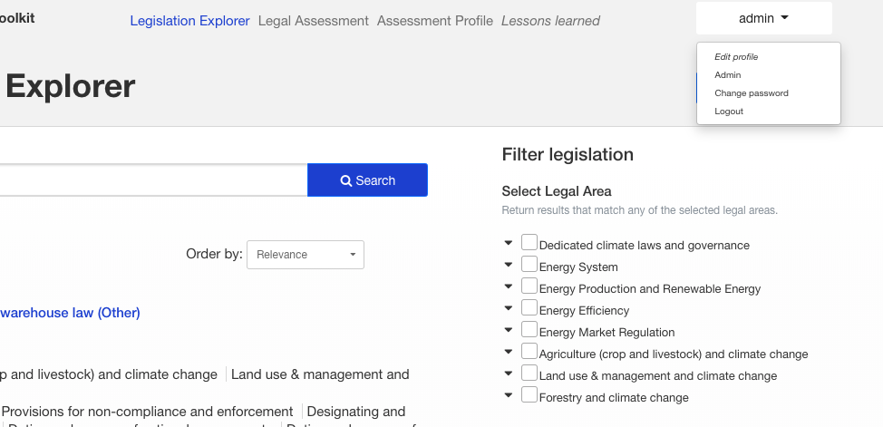

    *How to access the admin panel*

Once in the admin panel, the user should access "Authentication and Authorization">"Users".

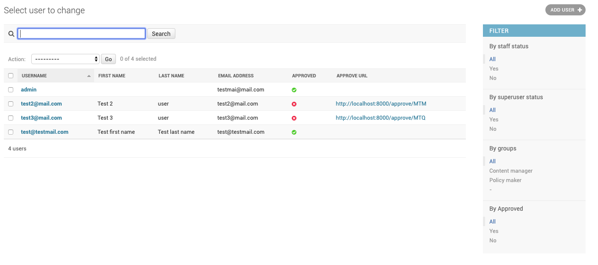

    *User listing in the admin interface*

The user can check in this listing the users(*Figure 6*) which are not approved and for those, access the approve URL and
proced as exaplined above.
The administrator user can also set a password for the new user. For that, the administrator should click on the username
of that user and they will be redirected to a detail page of the user. There, under the password field, is a link for
changing the user's password, as presented in *Figure 7*

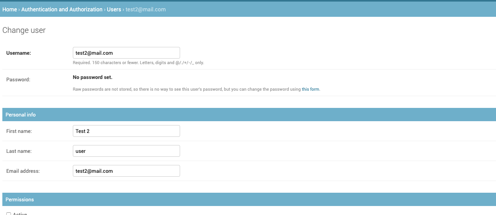

    *Change password of an user*

Legislation Explorer
====================

-------
Listing
-------

The legislation listing can be accesed at the following link: https://climatelawtoolkit.org/legislation/ , or through the
link in the home menu. (*Figure 8*)
The listing page allows the users to see the following information for each legislation: title, law type, date, country,
legal areas and cross-cutting categories.
The legislations can be ordered, filtered and searched.

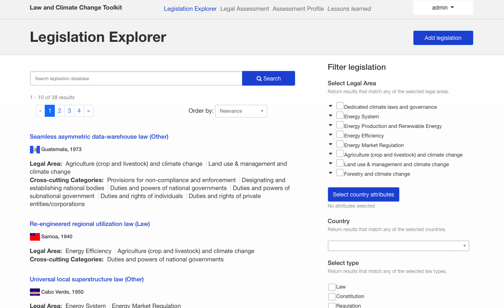

    *Legislation Listing*

Filtering
~~~~~~~~~

Legal Area
    The user can select to be shown only the legislations which have the legal areas selected.

Country attributes
    The user can filter legislations based on the countries critieria:
        - is it commonwealth?
        - is it small commonwealth?
        - is it a member of united nations?
        - is it a least developed country?
        - is it a landlocked developing country?
        - is it a small island developing state?
        - the region of the country
        - the subregion of the country
        - the legal system
        - the population range
        - the HDI range
        - the GDP range
        - total GHG Emissions excluding/including LUCF MtCO2e 2014

Country
    The user can filter legislations based on a list of countries 
Legislation type
    The user can filter legislations of only one type

Cross cutting categories
    The user can filter legislations which have the selected cross cutting categories

Promulgation year
    The user can filter legislations which were promulgated between a certain period

If multiple filters are selected, all legislations which respect at least one filter will be displayed.

Search
~~~~~~
The users can search terms in the legislation. The search is done in the legislation attributes or the articles of the
legislation.(*Figure 9*)

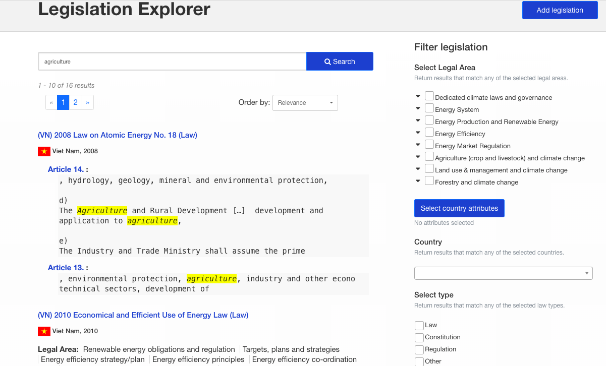

    *Legislation search results*

Order
~~~~~

The legislations can be ordered by the promulgation date, the country or the relevance. The relevance is calculated based
on the number of keywords found in a search in the legislation or its related articles. The legislations which has the
highest number of keywords will appear as the first results.

---------------
Add legislation
---------------

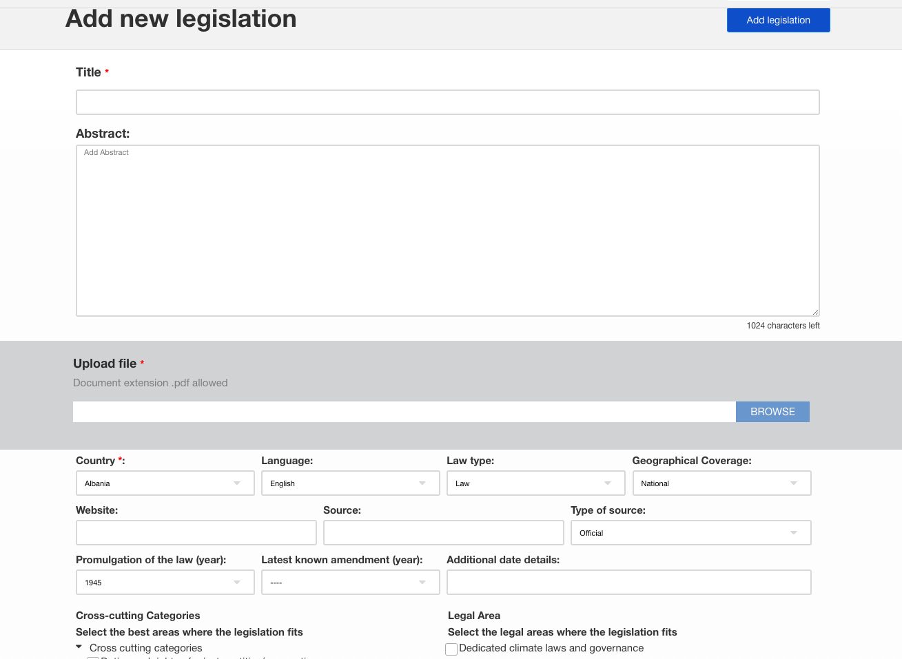

    *Add legislation*

Access Add legislation from the listing page of the legislations. The required information for creating a new legislation
are a title, a PDF document containing the legislation, a country and the promulgation year.(*Figure 10*) After the creation
of the document you will be redirected to the detail page of the newly created object.

---------------------------
Detail page for legislation
---------------------------

The detail page can be accessed from the listing of legislations, by clicking the legislation title. On the detail page,
the users can check all the details of that particular legislation. Also, the users can choose to edit the legislation,
delete the legislation, add and view the articles.(*Figure 11*)

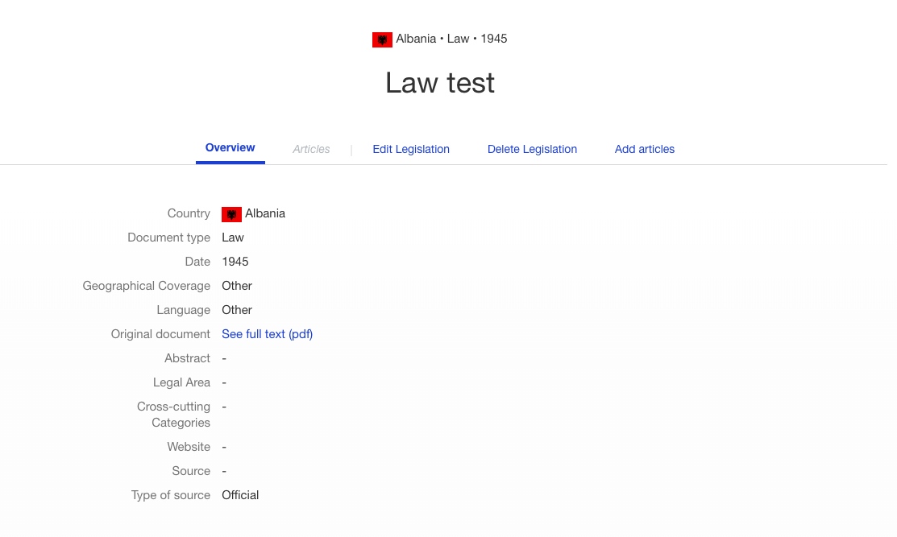

    *Legislation details*

---------------
Edit legilation
---------------

The edit page of the legislation is similar to the Add legislation page. This page also contains links for adding
articles, manage articles and the detail page of the legislation the user is editing.

------------------
Delete legislation
------------------

Deleting the legislation is a straight forward process. After clicking on the "Delete legislation" link, the user
will be asked to confirm the deletion and, if they answer yes, the legislation will be deleted.

Articles
========

---------------
Adding articles
---------------

For each legislation, the articles must be created manually. For this, the tool provides an interface for extracting the
articles from the PDF document. The articles must be extracted from the document and then tagged with the related
cross-cutting categories and legal areas. (*Figure 12*) At the end of the page, the previous article is displayed in order
to help the user keep track of where the last article ended.

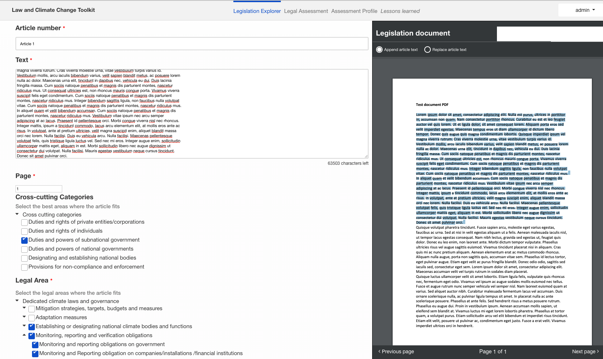

    *Article creation*

-------------
Articles list
-------------

The articles are listed under the "Articles" tab in the Legislation Details page. For each article the user can check
the text and the legal areas and cross-cutting categories. From this page, the user can choose to edit or delete an article.(*Figure 13*)

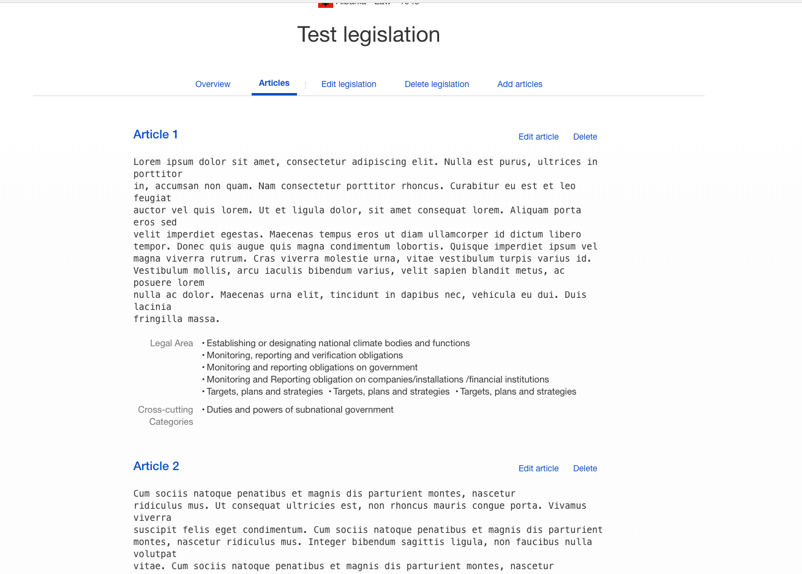

    *Article list*

----------------
Articles editing
----------------

The editing of the article is similar to adding a new article.

---------------
Articles delete
---------------

As in the case of Legislation, deleting an article is a simple process. After clicking on the "Delete article" link,
the user will be asked to confirm the deletion and, if they answer yes, the article will be deleted.

Legal Assessment
================

The user can create Legal Assessments for a country to identify potential gaps in the legislation and areas that could be improved.
For entering this section of the application, the user should click on the "Legal Assessment" tab from the homepage.

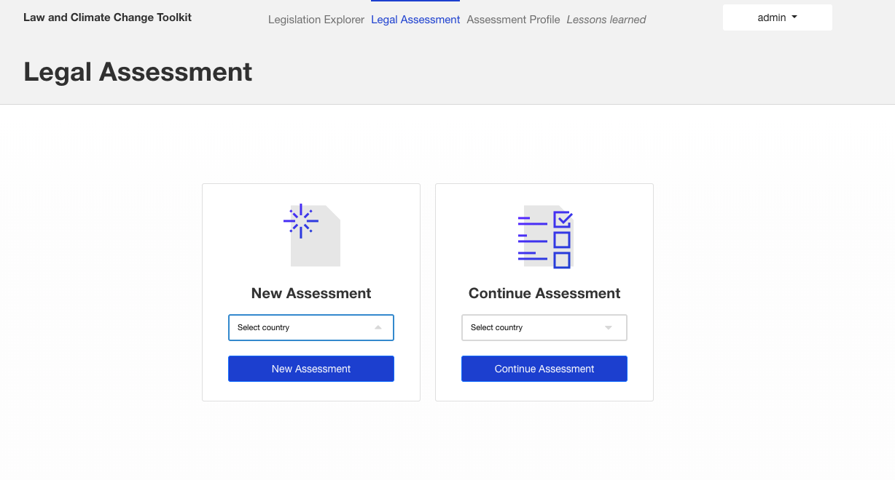

    *Legal assessments main page*

On this page the user has an option to either continue an already existing assessment or to start a new one. For this, the user
has to select the country of interest.(*Figure 14*)

---------------------
Answering assessments
---------------------

After selecting the country, the user will be redirected to a series of questions they can answer regarding the country's climate
change related law. Depending on the answer of some questions, new questions might pop up. The user does not have to answer all
the questions to see the result of the asssessment.(*Figure 15*)

.. figure:: figures/figure_legal_assessment_answer_questions.png
    :width: 600px
    :align: center
    :target: _images/figure_legal_assessment_answer_questions.png

    *Answering assessment questions example*

------------------
Assessment results
------------------

On the results page of an assessment, the user can see all the questions that generated gaps and for which legal areas the gaps
where generated. The user might also receive a sugestion for how the legislation could be improved from other legislations
available in the application, which have articles containing informations that treat the legal area in which the assessment's
country has a gap. By default, all countries are taken into account for sugestions, but the user may filter those countries in
order to obtain sugestions only from countries similar to the assessment's country. Those filters are similar to the ones present
on the Legislation listing page and can be activated by clicking on the "Select country attributes" button.

The user also has the option to download the results as a PDF file.

An example of a possible result is given in *Figure 16*

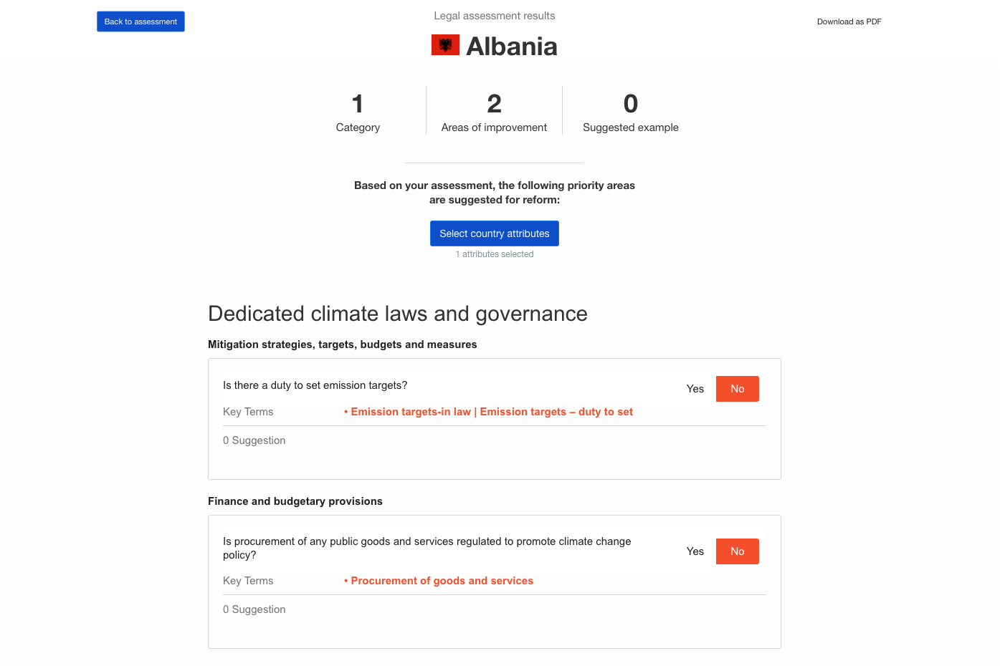

    *Legal assessment results example*

Assessment Profile
==================

The assessment profile page can be accessed through the homepage by clicking on the "Assessment Profile" tab.
Each country has a profile containing various informations used in filtering the legislation and assessments.
The user can select the profile of any country they want. (*Figure 17*)

.. figure:: figures/figure_assessment_profile.png
    :width: 600px
    :align: center
    :target: _images/figure_assessment_profile.png

    *Assessment profile*

The user may also change the profile of a country. If so, then both the original and the modified version will
be shown side by side. There is also the option to revert to the original version.

.. figure:: figures/figure_assessment_profile_editing.png
    :width: 600px
    :align: center
    :target: _images/figure_assessment_profile_editing.png

    *Assessment profile editing*

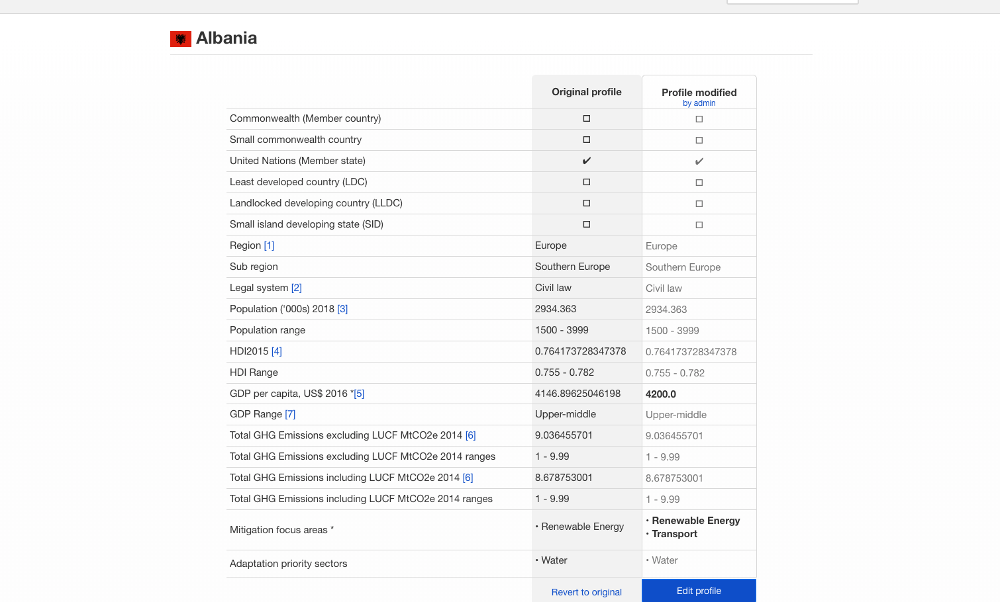

    *Assessment profile after editing*

Users
=====
In the application there are 3 types of users: Policy maker, Content manager and Administrator.
Each user role is explained below.

------------
Policy maker
------------

A user who has this role is able to edit assessment profiles, create legal assessments, but they are not
able to add new legislation and articles, or edit the existing ones.

---------------
Content manager
---------------

A user who has this role is able to to edit assessment profiles, create legal assessments and also
add legislations or articles and edit the existing ones.

-------------
Administrator
-------------

An administrator is able to do all the above actions in the application. This user also has access to
an administration interface where they can add, edit and delete all the information in the application.

Administration interface
========================

As stated above, the administration interface can be accessed through a link in the dropdown of the user.

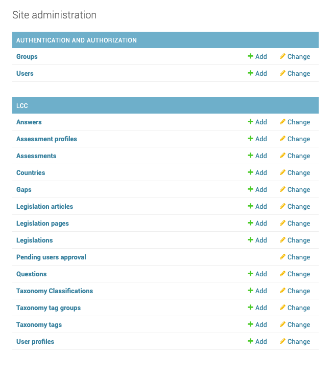

    *Assessment administrator*
